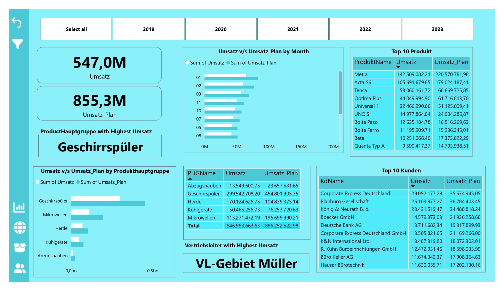

# Anand's Analytics Portfolio
# Project 1 - Sales Dashboard and Datawarehouse with Product and Customer Hierarchy Levels(https://github.com/anandjain55/Sales-Dashboard)
* This is the project I did during my internship which includes first importing data into SQL Server using SSIS.
* Procedure followed during project is as follows:
1. Staging Area of Datawarehouse has been created using SSIS and then all raw data has been imported to SQL Server.
2. In SQL Server CORE Layer has been created for Dimension and Fact tables using Stored Procedures.
3. StarSchema has been generated from these tables.
4. Views has been generated from Core Layer.
5. Power BI Dashboard containing Executive Dashboard, Customer and Product Level Dashboards has been created using views of the Core Layer Data.
* Data is from real company data
* Tools used - Sql Server management Studio, Visual Studio and Power BI Desktop.
* Skills - Sql Server Integration Services, Sql Server and Power BI

Overview of  Executive Dashboard

