# Anand's Analytics Portfolio

# Projekt 1 - Sales Dashboard und Datawarehouse mit Produkt- und Kundenhierarchieebenen (https://github.com/anandjain55/Sales-Dashboard)
* Dies ist das Projekt, das ich während meines Praktikums durchgeführt habe. Es beinhaltet zunächst den Import von Daten in SQL Server mit Hilfe von SSIS.
Die Vorgehensweise während des Projekts ist wie folgt:
1. Der Staging-Bereich von Datawarehouse wurde mit SSIS erstellt und dann wurden alle Rohdaten in SQL Server importiert.
2. In SQL Server wurde ein CORE-Layer für Dimensions- und Faktentabellen mithilfe von Stored Procedures erstellt.
3. StarSchema wurde aus diesen Tabellen generiert.
4. Ansichten wurden aus dem Core Layer generiert.
5. Power BI Dashboard mit Executive Dashboard, Customer und Product Level Dashboards wurde unter Verwendung von Views der Core Layer Daten erstellt.
* Die Daten stammen aus echten Unternehmensdaten.
* Verwendete Tools - SQL Server Management Studio, Visual Studio und Power BI Desktop.
* Kenntnisse - Sql Server Integration Services, Sql Server und Power BI

Überblick über das Executive Dashboard
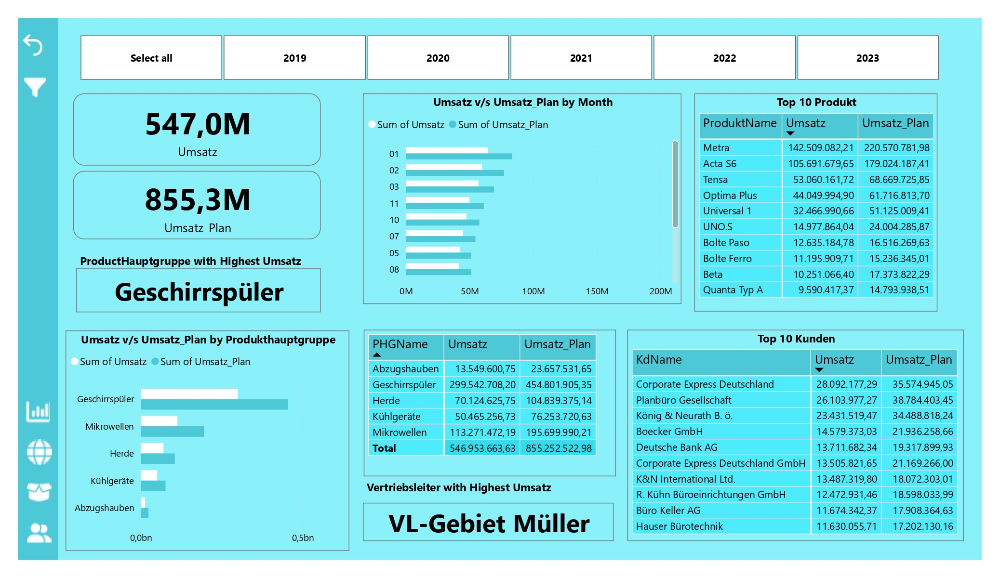

Übersicht über das Produkt-Dashboard

Übersicht über das Kunden Dashboard 
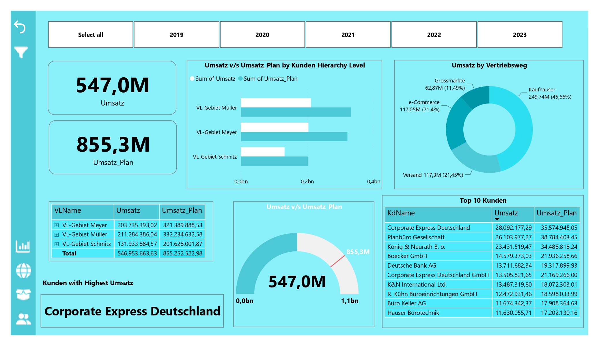

Übersicht über die Kartenebene 
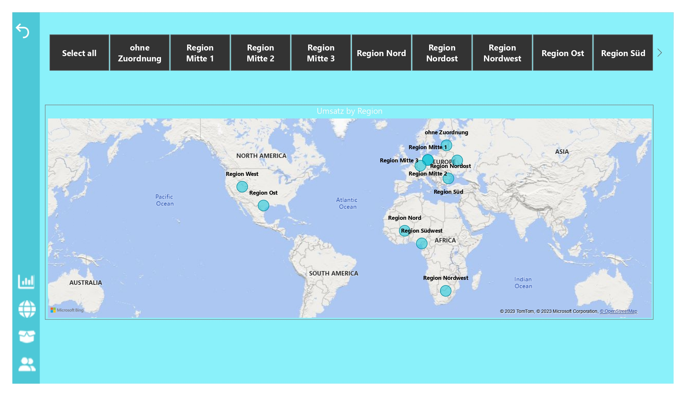

Übersicht der Produkthierarchie-Ebene 
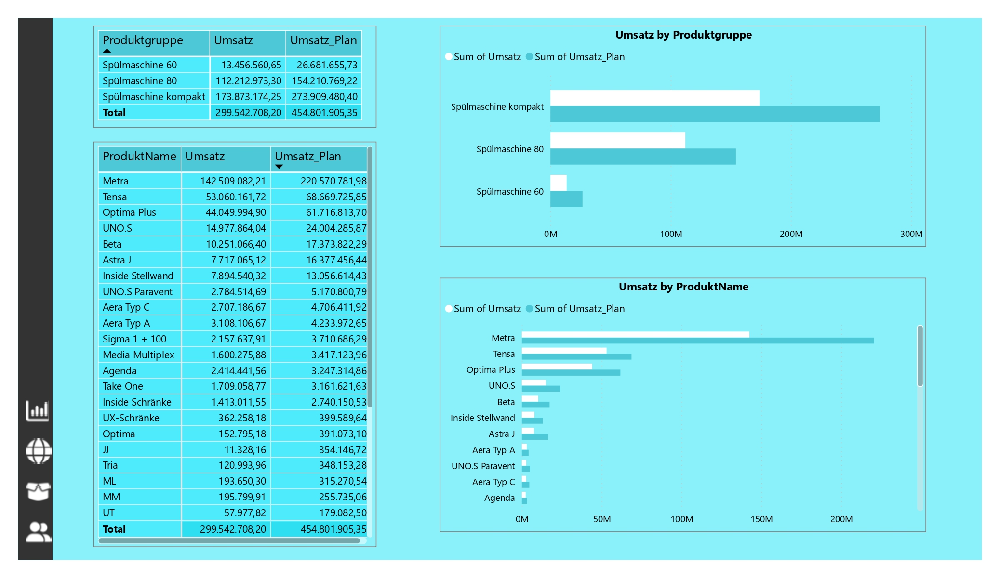

Übersicht der Kundenhierarchie-Ebene 
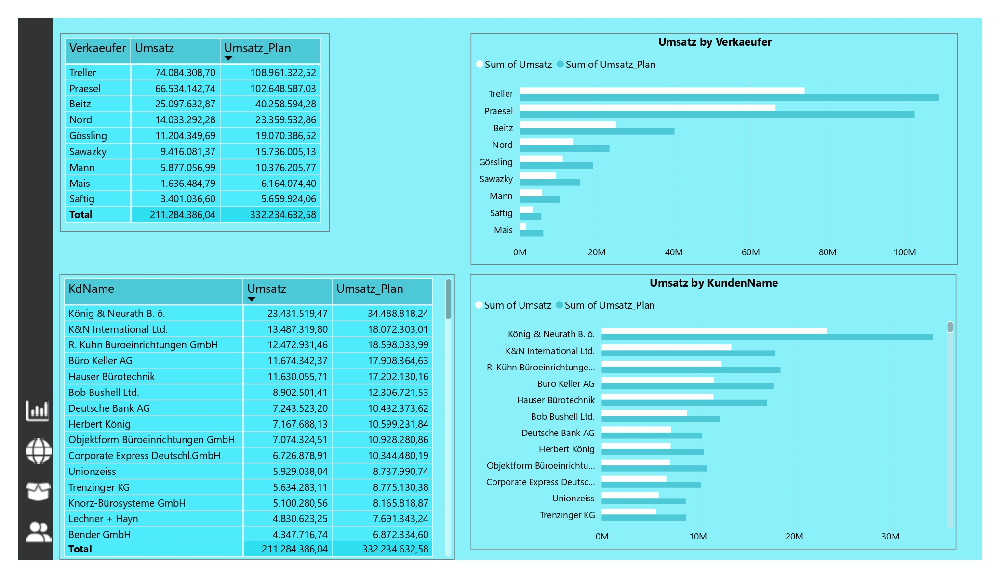

# Projekt 2 - Hotel Revenue Dashboard (https://github.com/anandjain55/SQL_Power-BI_Hotel-Revenue_Dashboard)
Dies ist das Projekt, das ich während meiner Kurse durchgeführt habe. Die Daten werden zunächst in SQL Server verarbeitet und dann in Power BI importiert und ein Dashboard erstellt.

* Die Daten stammen aus echten Unternehmensdaten.
* Verwendete Tools - SQL Server Management Studio und Power BI Desktop.
* Kenntnisse - Sql Server und Power BI

Überblick über das Executive Dashboard
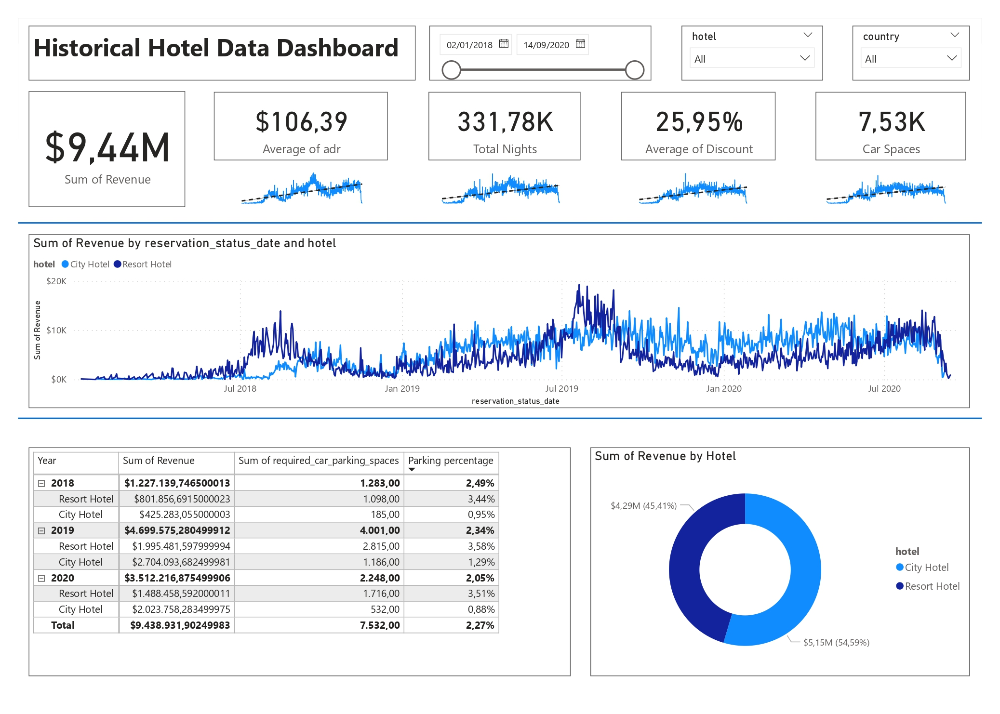

# Projekt 4 - HR Data Analytics Dashboard (https://github.com/anandjain55/Excel_HR_Analytics_Dashboard)
Dies ist das Projekt, das ich während meiner Kurse durchgeführt habe. Dabei werden die Daten zunächst in Excel verarbeitet und dann das Dashboard in Excel erstellt.

Die Daten stammen aus echten Unternehmensdaten.
Verwendete Tools - Power Pivot 
Kenntnisse - Excel

Überblick über das Executive Dashboard 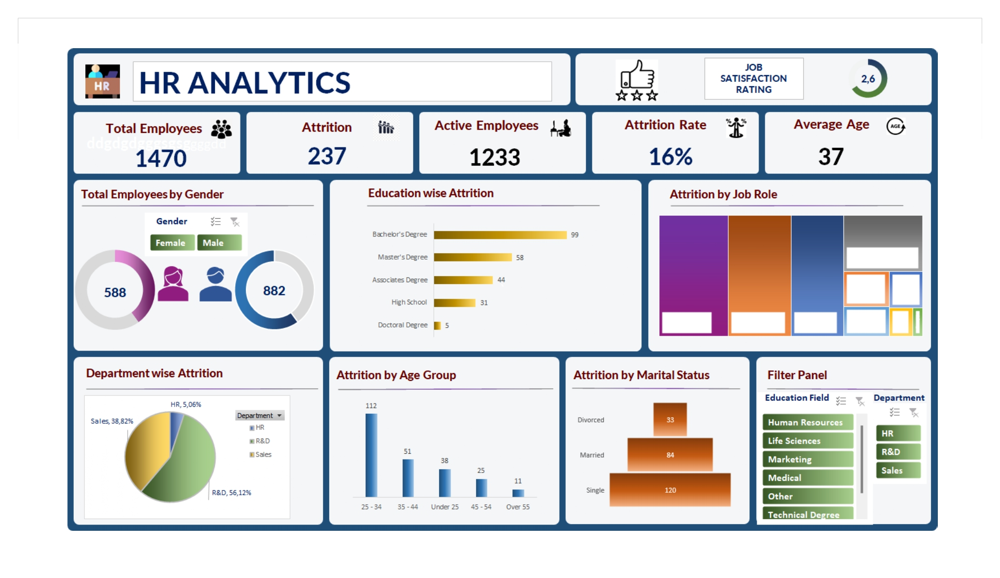

# Projekt 4 - Personliche-Finanzen-Tracker-Dashboard (https://github.com/anandjain55/Personliche-Finanzen-Tracker-Dashboard)
Dabei werden zunächst die Daten in Power BI verarbeitet und anschließend das Dashboard ebenfalls in Power BI erstellt.

* Fragen, die während dieses Projekts beantwortet werden, sind:
1. Gebe ich aus, was ich verdiene, oder spare ich, was ich verdiene?
2. Wo / Wie gebe ich aus?
3. Wo / Wie spare ich?
4. Detaillierte Erklärung
Verwendete Tools - Power BI Desktop
Kenntnisse - Power BI, Power query, DAX

Überblick über das Executive Dashboard 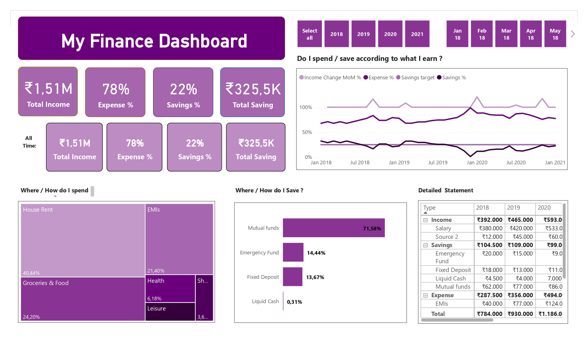, 
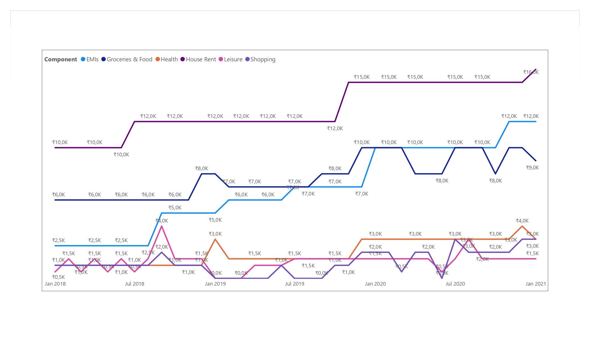,
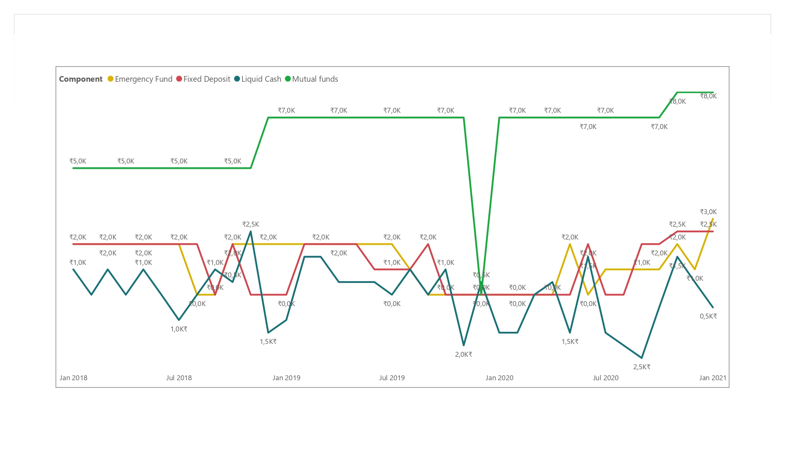,
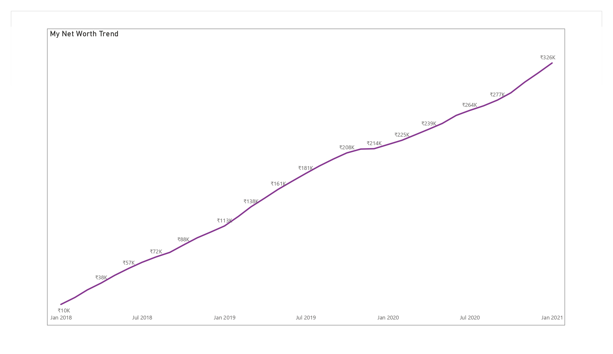,

# Projekt 5 - Globale Supertstore_2016 Umsatz-Dashboard (https://github.com/anandjain55/Globale-Supertstore_2016-Umsatz-Dashboard)
Dabei werden zunächst die Daten in Power BI verarbeitet und anschließend das Dashboard ebenfalls in Power BI erstellt.
Verwendete Tools - Power BI Desktop
Kenntnisse - Power BI, Power query, DAX

Überblick über das Executive Dashboard 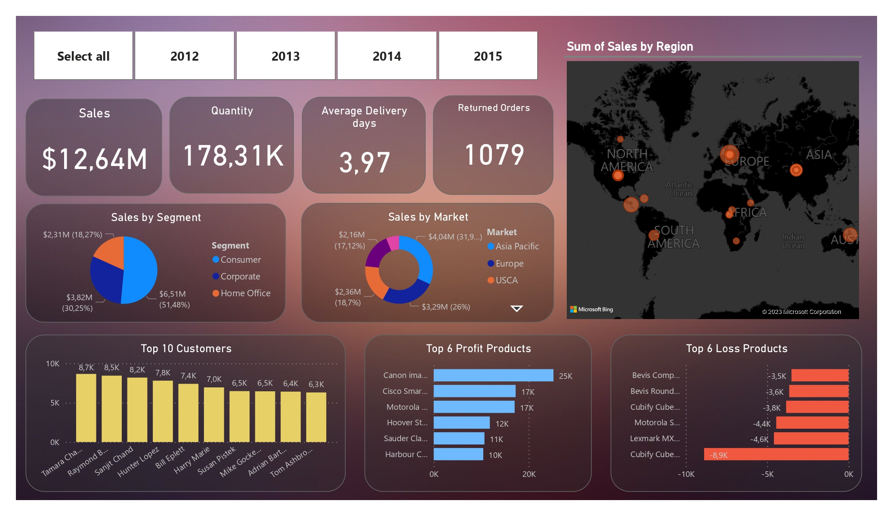

# Projekt 5 - Dashboard der AdventureWorks Bike Company (https://github.com/anandjain55/AdventureWorks-Bike-Company-Report)

Geschäftsproblem -
Sie wurden gerade von AdventureWorks, einem fiktiven globalen Produktionsunternehmen, das Fahrradausrüstung und -zubehör herstellt, als Business-Intelligence-Analyst eingestellt. Und Ihre Aufgabe besteht darin, dem Managementteam dabei zu helfen, seine KPIs wie Umsatz, Umsatz, Gewinn und Rendite zu verfolgen, die Leistung über Regionen hinweg zu vergleichen, Trends auf Produktebene zu analysieren und hochwertige Kunden zu identifizieren.

Aber alles, was Sie erhalten haben, ist ein Ordner mit CSV-Rohdateien, die Informationen zu Transaktions- und Retourendatensätzen, Produkten, Kunden und Vertriebsgebieten enthalten.

Ziel erreicht -
Verwendete den Power BI-Desktop, um diese Rohdaten zu verbinden und zu transformieren, erstellte ein relationales Datenmodell, erstellte berechnete Spalten und Kennzahlen mit DAX und entwarf schließlich ein interaktives Dashboard, um die Visualisierung und Analyse dieser Daten zu unterstützen.

Wichtige Schritte, die im Projekt (Verfahren) erreicht wurden
1. Erstellen Sie die Executive Summary-Ansicht, die allgemeine KPIs (Umsatz, Gewinn, Bestellungen, Rücklaufquote), ein wöchentliches Umsatztrenddiagramm, coole interaktive Elemente wie Schieberegler zum Vergrößern bestimmter Zeiträume, benutzerdefinierte Tooltipps und einen vollständig benutzerdefinierten Filterbereich enthält .
2. Sie können einen Drilldown zu einem bestimmten Produkt durchführen, um zur Produktdetailansicht zu gelangen. Dadurch werden Dinge wie die Leistung eines Produkts im Vergleich zu seinem monatlichen Bestell-, Umsatz- oder Gewinnziel angezeigt.
3. Ich habe Dinge wie Parameter für die Was-wäre-wenn-Analyse verwendet. Wie verändert sich in diesem Fall der Preis und wirkt sich dies auf eine Kennzahl wie den Gesamtgewinn aus?
4. Ich habe Feldparameter untersucht, um diese Diagramme für Endbenutzer interaktiver und dynamischer zu gestalten.
5. Ich habe mir die Kartierungs- und Geodatentools von Power BI genauer angesehen und auch eine Ansicht auf Kundenebene erstellt, um die Leistung auf der Ebene einzelner Kunden genauer zu untersuchen und verschiedene Kundenprofile und -segmente aufzuschlüsseln.
6. Dieser gesamte Bericht wurde komplett von Grund auf neu erstellt und enthält lediglich einen Ordner mit rohen CSV-Dateien.

Ergebnis und Schlussfolgerung -
Wir können KPIs (Umsatz, Umsatz, Gewinn, Rendite) verfolgen, die regionale Leistung vergleichen, Trends auf Produktebene und hochwertige Kunden analysieren.

Überblick über das Executive Dashboard
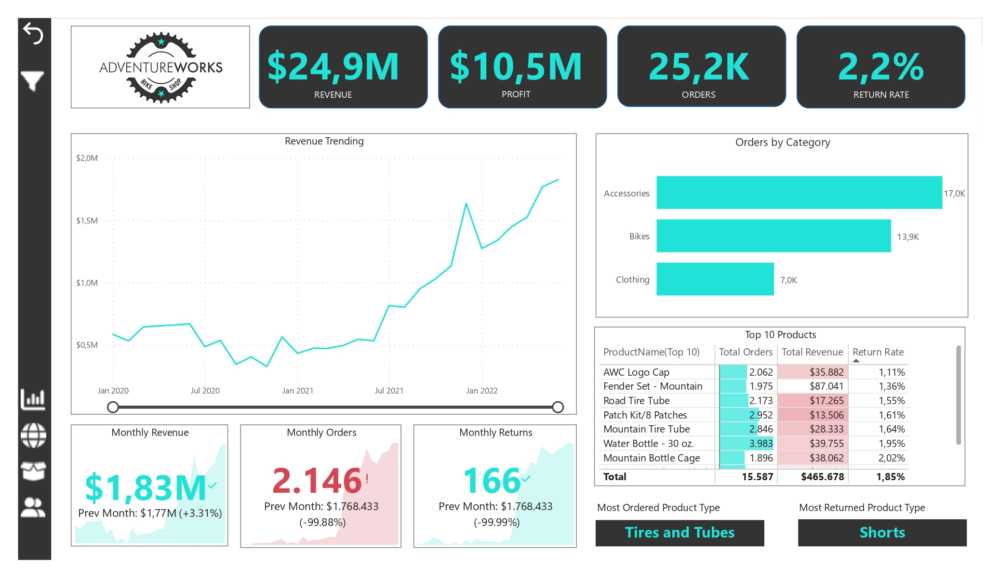

Übersicht der Produktdetails
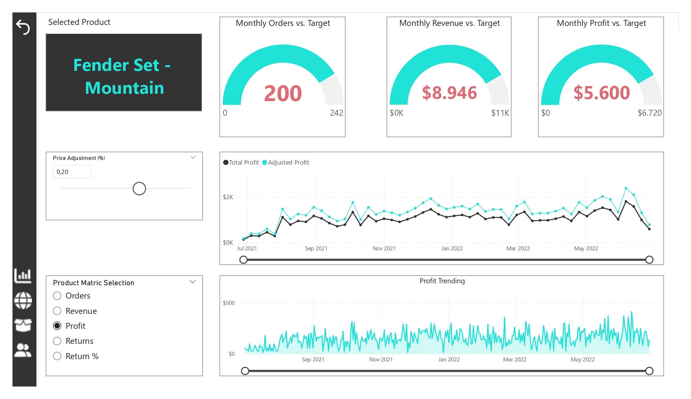

Übersicht der Kundendaten
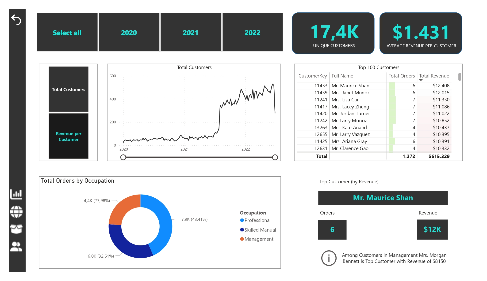

Übersicht über die Kartenansicht

Übersicht über den Tooltip für die Kategorie
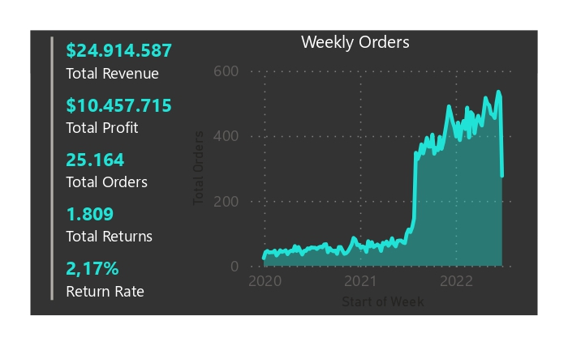

Übersicht über benutzerdefinierte visuelle Elemente (animiertes Barrennen)
.jpg)

