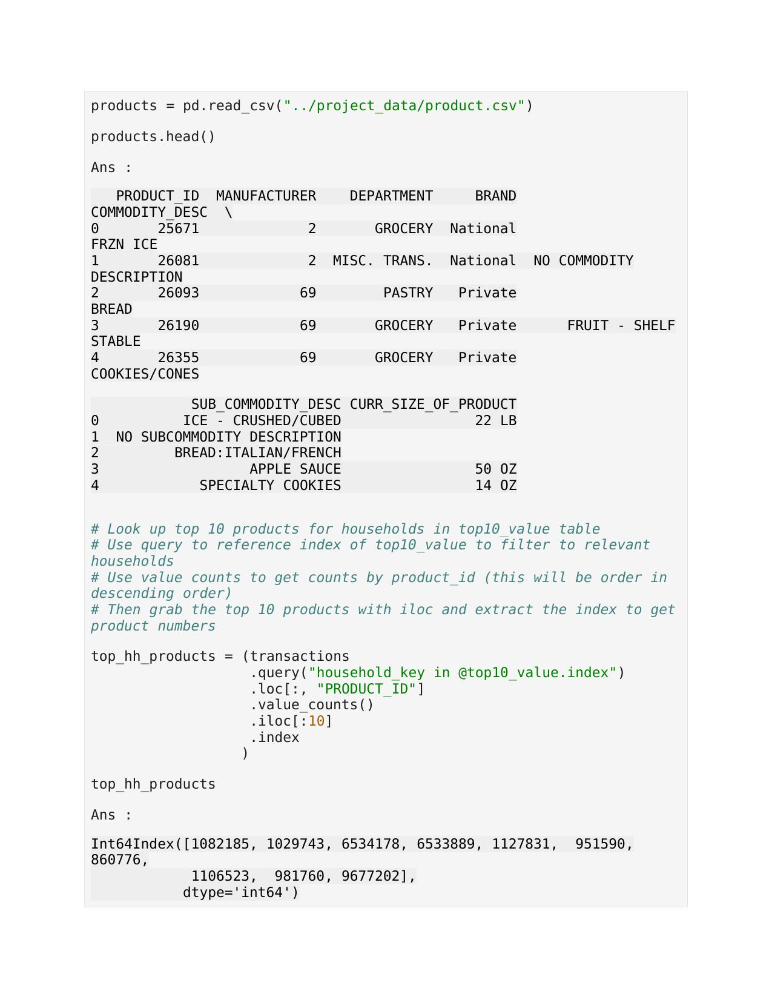

# Anand's Analytics Portfolio

# Projekt 1 - Datamart-Erstellung und Analyse hierarchiebasierter Verkaufsdaten 

## Geschäftsfall :
In diesem Projekt müssen Sie mit den Daten vieler Unternehmen arbeiten, die sich mit einer Vielzahl von Produkten beschäftigen. Ihre Aufgabe ist es, die Daten mit SSIS aus der Hauptdatenbank zu extrahieren, einen Staging-Bereich zu erstellen und dann DataMart in SQL Server zu erstellen. Sie sollten KPI für den Verkauf verfolgen, kreative Diagramme erstellen, die die Verkäufe nach Monat und Jahr zeigen, hochwertige Kunden und Trends auf Produktebene analysieren.
Außerdem sollten Sie in der Lage sein, für weitere Details auf Produkt- und Kundenebene aufzuschlüsseln. Ihr Bericht sollte einen Vergleich der Ist-Werte mit den Budgetwerten der Verkäufe enthalten.

## Die wichtigsten Schritte während des Projekts sind folgende :
1. Der Staging-Bereich des Datawarehouse wurde mithilfe von SSIS erstellt und alle Rohdaten wurden in den SQL Server importiert.
2. In SQL Server wurde ein CORE-Layer für Dimensions- und Faktentabellen mithilfe von Stored Procedures erstellt.
3. StarSchema wurde aus diesen Tabellen generiert.
4. Ansichten wurden aus dem Core Layer generiert.
5. Power BI Dashboard mit Executive Dashboard, Customer und Product Level Dashboards wurde mit Hilfe von Views der Core Layer Daten erstellt.

## Die wichtigsten Erkenntnisse :
1.	Der Umsatz für das ganze Jahr beträgt 547 Mio. 
2.	Geshirrspüler hat höchsten Umsatz von 2019-2023.
3.	Metra hat höchsten Umsatz von 2019-2023.
4.	Kunde Corporate Express Deutschland hat höchsten umsatz von 547 M von 2019-2023.
5.	VL- Gebiet Müller ist der vertiebsleiter mit dem höchsten umsatz für alle Jahre.
6.	Donut Chart für UmsatzPlan vers umstzplan by Vertiebsweg zeigt, dass Kaüfhauser den höchsten umsatz von 2019-2023 hat.

## Ergebnis und Schlussfolgerung aus dem Dashboard :
1.	Umsatzdaten für alle Produkthierarchien aus den Jahren 2019 bis 2023 und umsatzplan Daten von 2021-2023
2.	Umsatz_Plan Karte zeigt den prognostizierten Umsatz für das ausgewählte Jahr von 2021-2023. Wir können den aktuellen und den vorhergesagten Umsatz aus beiden Karten vergleichen.
3.	Wir können den Monats- und Jahres-Slicer mit anderen Karten kombinieren, um das Produkt und den Kunden mit dem höchsten Verkaufswert pro Jahr und Monat zu filtern 
4.	Wir können die tatsächlichen und geplanten Verkaufswerte für Produkte und Kunden für alle 3 Hierarchieebenen der Produkt- und Kundenmatrix vergleichen.
5.	Wir können auch die Ist- und Budget-Verkaufswerte für die Top-Produkte und Top-Kunden vergleichen.
6.	Anhand des Guage-Diagramms können wir die Differenz zwischen Budget und tatsächlichem Verkaufswert für einen bestimmten Kunden ermitteln.
7.	7.	Das Schaubild zeigt den Minimalwert als 0 und den Maximalwert als das Doppelte des Umsatzes, wobei der Abrufwert der tatsächliche Umsatz von 2019-2023 und der Zielwert der Budget-Umsatz (umsatz_plan) von 2021-2023 ist.
8.	Das Ausblenden des Slicer-Panels enthält den Vertriebsweg-Slicer, der hilft, die Umsatzwerte von Kunden und Produkten zu filtern. 

### Icons und Logos :
Beschreibende Icons werden verwendet, um von einer Seite zur anderen zu wechseln, wie z.B. Produkt, Kunde, Karte und exec Dashboard. Das Slicer-Logo wurde verwendet, um den Vertriebsweg-Slicer auszublenden, um den Platz auf der Seite zu sparen. 

### Produkt- und Kundenhierarchieseiten:
Die Produkt- und Kundenhierarchieseiten enthalten detailliertere Informationen über Kunden und Produkte. Von der Seite "Executive Dashboard" oder "Product" können wir auf die Seite "Product Hierarchy" gehen, um mehr Details über Produkte zu sehen, während wir von der Seite "Customer" auf die Seite "Customer Hierarchy" gehen können, um mehr Details über Kunden zu sehen.

## Verwendete technische Tools : 
Sql Server Management Studio, Visual Studio und Power BI Desktop, 

## Verwendete Techniken/Fähigkeiten :
SQL Server - Sql Server Integration Services, ETL, Datamart, Gespeicherte Prozeduren, Ansichten,
Power BI - DAX, Datenmodellierung, Datenvisualisierung.

###  Überblick über das Executive Dashboard 

###  Übersicht über das Dashboard auf Produktebene 

###  Übersicht über die Kundenebene_Dashboard

###  Kartenansicht 

###  Übersicht der Produkthierarchie-Ebene 

###  Übersicht der Kundenhierarchie-Ebene 

# Projekt 2 – Persönliche Finanz-Tracker-Analyse 

## Geschäftsproblem und kontext
Erstellung eines persönlichen Finanz-Trackers, der bei der Verwaltung und Kontrolle der finanziellen Ausgaben hilft. Das Ziel dieses Projekts ist es, schon in jungen Jahren finanzielle Kenntnisse zu vermitteln und die Analytik in das tägliche Leben einzubinden.

## Datenquelle:
Die Rohdaten der durchschnittlichen Ausgaben des Jahres 2022 aus Indien wurden in Excel erstellt.

## Befolgte Vorgehensweise : 
1.	Die Rohdaten wurden in Excel erstellt und dann in Power BI importiert. 
2.	ETL wurde für die Daten mit Power BI durchgeführt, und die bereinigten Daten wurden dann zur Erstellung eines Dashboards in Power BI verwendet.

## Abgeleitete Schlüsselerkenntnisse:
1.	Mit Hilfe der KPIs des Berichts erhalten wir Einblicke in das Nettovermögen, die Genauigkeit des Ausgabenmusters, den Status der Sparziele, die besten und schlechtesten Finanzmonate in Bezug auf Ausgaben und Einsparungen.
2. Slicer hilft, Daten nach Jahr und Monat zu filtern.
3.	Das Liniendiagramm hilft zu erkennen, ob Geld gespart oder ausgegeben wird im Vergleich zu dem, was verdient wird.
4.	Baumdiagramme geben Aufschluss über die Ausgaben in verschiedenen Bereichen und deren prozentualen Anteil.
5.	Balkendiagramme geben Aufschluss über den prozentualen Anteil des eingesparten Geldes in den einzelnen Bereichen.

## Ergebnis und Schlussfolgerung aus dem Dashboard:
1.	Das höchste Einkommen ist im Jahr 2020 und sein Wert ist 593K INR mit 17 % Gesamtersparnis (99 K INR)
2.	Die höchsten Ausgaben werden für die Wohnungsmiete getätigt, was etwa 37 % entspricht, und das meiste Geld, etwa 87 %, wurde in Investmentfonds gespart. 
3.	Der Prozentsatz der Ersparnisse im Jahr 2020 ist höher als der Prozentsatz der Ersparnisse aller Zeiten, während der Prozentsatz der Ausgaben niedriger ist als der Prozentsatz der Ausgaben aller Zeiten.
4. Die höchste Ersparnis von 27 % wurde im Jahr 2018 erreicht.
5.	Das Liniendiagramm zeigt, dass das Sparziel bis zum Jahr 2020 gut ist, dann aber wieder sinkt.
6.	Die Einsparung in % nimmt von 2018 bis 2020 ab, während sie von 2020 bis 2021 wieder ansteigt und die Ausgaben in % das umgekehrte Muster zeigen.

## Verwendete technische Tools : 
 MS Excel, Power BI Desktop.

## Verwendete Techniken / Fertigkeiten / Software :
Excel, 
Power BI- DAX, Datenvisualisierung.

### Überblick über das Executive Dashboard 

### Tooltips 
,
,
,

# Projekt 3 - Datenanalyse der AdventureWorks Bike Company 

## Geschäftsproblem :
Entwickeln Sie eine Datenbank zur Analyse und Visualisierung von Hotelbuchungsdaten und erstellen Sie dann mit Power BI ein Dashboard, das Sie Ihren Stakeholdern präsentieren können. Das Dashboard sollte die Trends der Einnahmen, des durchschnittlichen Tagessatzes pro Nacht, des durchschnittlichen Rabatts und der benötigten Parkplätze zeigen. Sie müssen die Frage beantworten, ob die Hoteleinnahmen und der durchschnittliche Tagessatz von Jahr zu Jahr steigen und ob wir die Größe unserer Parkplätze erhöhen sollten.

## Datenquelle:
Historische Hoteldaten von 2018-2020.

## Wichtige Erkenntnisse:
1. KPIs für Umsatz, durchschnittliche Tagesraten, Gesamtübernachtungen, durchschnittliche Rabatte und benötigte Parkplätze helfen, einen Überblick über die Hoteldaten zu erhalten.
2. Datums-, Hotel- und Länderslicer helfen, die Daten nach Bedarf zu filtern und KPI's zu ändern.
3. Ein Liniendiagramm hilft, die Umsatzentwicklung der beiden Hotels für einen bestimmten Zeitraum zu vergleichen.
4. Die Matrix zeigt einen Überblick über die Umsatzdaten und die benötigten Parkplätze, was uns hilft, unser Geschäftsproblem in Bezug auf die Größe des Parkplatzes zu lösen. Die blau hervorgehobenen Zeilen zeigen die höchsten Werte an.

## Ergebnis und Schlussfolgerung aus dem Dashboard:
1. Der Hotelumsatz steigt von 2018 bis 2020. Der höchste Umsatz ist im Jahr 2019 von 2018 bis 2020 und sein Wert beträgt 26,63 Millionen Dollar für beide Hotels und alle Länder. Von beiden Hotels ist der Wert 2019 für das Stadthotel am höchsten und beträgt 7,19 Mio. USD für alle Länder.
2. Da der Anteil der Parkplätze stagniert, haben wir nicht viele Anhaltspunkte, um zu entscheiden, ob wir einen Parkplatz bauen sollten oder nicht.
3. Die Adr steigt von 2018-2020. Der höchste durchschnittliche Tagessatz ist im Jahr 2019 zwischen 2018 und 2020 und sein Wert beträgt 119,86 Millionen Dollar für beide Hotels und alle Länder. Für beide Hotels ist der durchschnittliche Tagessatz für das Stadthotel im Jahr 2020 mit 123,02 Mio. USD für alle Länder ebenfalls am höchsten.

## Verwendete technische Tools : 
Sql Server Management Studio, Power BI Desktop.

## Verwendete Techniken/Fähigkeiten :
Power BI -  Datenvisualisierung, DAX.

###  Überblick über das Executive Dashboard 

###  Übersicht über das Dashboard auf Produktebene 

###  Übersicht über die Kundenebene_Dashboard

###  Übersicht über den Tooltip für die Kategorie 

###  Übersicht über benutzerdefinierte visuelle Elemente (animiertes Barrennen) 
.jpg)

# Projekt 4 - Humanressourcen Datenanalyse 

Dies ist das Projekt, das ich während meiner Kurse durchgeführt habe. Dabei werden die Daten zunächst in Excel verarbeitet und dann das Dashboard in Excel erstellt.

## Geschäftliches Problem
Sie arbeiten als Datenanalyst und müssen der Personalabteilung des Unternehmens einen interaktiven und dynamischen Bericht mit Excel zur Verfügung stellen, in dem die Beschäftigungsinformationen dargestellt werden. Die Personalabteilung möchte die Gesamtzahl der aktiven und ausscheidenden Mitarbeiter nach Geschlecht, Ausbildung, Funktion, Abteilung, Altersgruppe und Familienstand kennen, damit das Unternehmen Einblicke in die Beschäftigungssituation erhält. Die Personalabteilung möchte auch wissen, wie viele Mitarbeiter mit ihrer Arbeit zufrieden sind.

## Abgeleitete Schlüsselerkenntnisse :
1.	Dieses Dashboard ist vollständig interaktiv und dynamisch.
2.	Die Personalabteilung kann Einblicke in die Leistung der Unternehmen in Bezug auf Bildungsbereiche, Abteilungen und Geschlecht erhalten.
3.	Dieses Dashboard konzentriert sich hauptsächlich auf die Fluktuation, d.h. auf die Mitarbeiter, die das Unternehmen verlassen. Die KPIs geben Aufschluss über die Gesamtleistung des Unternehmens und einen Gesamtüberblick über die Personalabteilung.
4.	Es veranschaulicht, wie viele Mitarbeiter das Unternehmen nach Alter, Geschlecht, Familienstand und Aufgabenbereich verlassen.
5.	Wir haben Slicer wie Bildungsbereich, Abteilung und Geschlecht, nach denen wir visuelle Darstellungen filtern und das Dashboard dynamisch betreiben können, und die Daten wurden entsprechend dem ausgewählten Bildungsbereich, der Abteilung und dem Geschlecht geändert.
6.	Oben rechts befindet sich die Bewertung der Arbeitszufriedenheit, die in einem kleinen Donut-Diagramm dargestellt ist.
7.	Kleine Donut-Diagramme und Formen wurden verwendet, um die Gesamtzahl der Mitarbeiter nach Geschlecht darzustellen.
8.	Das Tortendiagramm zeigt die Fluktuation in den einzelnen Abteilungen.
9.	Ein Baumdiagramm zeigt die Fluktuation nach Aufgabenbereich und deren Prozentsatz.
10.	Die Zuordnung nach Ausbildung wird in einem Balkendiagramm dargestellt, während die Fluktuation nach Gruppe in einem Säulen- oder Häufigkeitsdiagramm gezeigt wird.
11.	Ein Trichterdiagramm zeigt die Fluktuation bei geschiedenen, ledigen und verheirateten Mitarbeitern.

## Ergebnis und Schlussfolgerung aus dem Dashboard:
1.	Die Gesamtzahl der aktiven Mitarbeiter für alle Abteilungen und Bildungsbereiche beträgt 1233 und die Fluktuationsrate der Mitarbeiter liegt bei 16 % mit einer Bewertung der Arbeitszufriedenheit von 2,6 von 4. 
Die Gesamtzahl der Mitarbeiter ist 1,5-mal höher als die der Frauen, wobei die höchste Fluktuationsrate bei Junggesellen und Labortechnikern zu verzeichnen ist. 
Junge Mitarbeiter der F&E-Abteilung weisen die höchste Fluktuation auf (56,12 %). Bei Alter und Familienstand ist die höchste Fluktuation bei alleinstehenden Arbeitnehmern im Alter von 25-34 Jahren zu verzeichnen. 
2.	Die höchste Fluktuationsrate von 24 % der 100 aktiven Mitarbeiter mit technischem Hochschulabschluss steht im Gegensatz zur Zufriedenheit mit dem Arbeitsplatz, die mit 3,9 von 4 Punkten bewertet wird. 
Die meisten Mitarbeiter, die aus diesem Bereich ausscheiden, sind alleinstehende Männer im Alter von 25 bis 34 Jahren, die einen Bachelor-Abschluss haben und in der Rolle eines Wissenschaftlers arbeiten. 
Die höchste Fluktuation (62,5 %) ist in der Forschungs- und Entwicklungsabteilung in diesem Bildungsbereich zu verzeichnen.
3.	Mitarbeiter mit dem Bildungsbereich Marketing sind mit einer Bewertung von 1,8 von 4 am wenigsten zufrieden.
4.	In der Abteilung Vertrieb ist die Fluktuation mit 21 % am höchsten, während sie in der Abteilung Forschung und Entwicklung mit 14 % am niedrigsten ist.

## Verwendete technische Tools: 
MS Excel, MS Power Point.

## Verwendete Techniken/Fähigkeiten :
Power Query Editor, Datenvisualisierung (KPIs, Slicer, Diagramme und Schaubilder)

###  Überblick über das Executive Dashboard 

# Projekt 5 - Analyse Historischer Hoteldaten 

## Geschäftsproblem :
Entwickeln Sie eine Datenbank zur Analyse und Visualisierung von Hotelbuchungsdaten und erstellen Sie dann mit Power BI ein Dashboard, das Sie Ihren Stakeholdern präsentieren können. Das Dashboard sollte die Trends der Einnahmen, des durchschnittlichen Tagessatzes pro Nacht, des durchschnittlichen Rabatts und der benötigten Parkplätze zeigen. Sie müssen die Frage beantworten, ob die Hoteleinnahmen und der durchschnittliche Tagessatz von Jahr zu Jahr steigen und ob wir die Größe unserer Parkplätze erhöhen sollten.

## Datenquelle:
Historische Hoteldaten von 2018-2020.

## Die wichtigsten Schritte im Projekt :
1. Aufbau einer Datenbank 
2. Analysieren und Abrufen von Daten mit SQL (Entwicklung einer SQL-Abfrage) 
3. Power BI mit einer Datenbank verbinden 
4. Daten in Power BI visualisieren
5. Unsere Ergebnisse zusammenfassen
   
## Key Insights abgeleitet:
1.	KPIs für Einnahmen, durchschnittliche Tagesraten, Gesamtübernachtungen, durchschnittliche Rabatte und benötigte Parkplätze helfen, einen Überblick über die Hoteldaten zu erhalten. 
2.	Datum, Hoteltyp und Land Slicer hilft, die Daten nach Bedarf zu filtern und auch KPI's wird geändert.
3.	Ein Liniendiagramm hilft, die Umsatzentwicklung beider Hotels für einen bestimmten Zeitraum zu vergleichen.
4.	Die Matrix zeigt einen Überblick über die Umsatzdaten und die benötigten Parkplätze, was uns hilft, unser Geschäftsproblem in Bezug auf die Größe des Parkplatzes zu lösen. Die blau markierten Linien zeigen die Zeile mit dem höchsten Wert.
   
## Ergebnis und Schlussfolgerung aus dem Dashboard :
1.	Die Hoteleinnahmen steigen von 2018 bis 2020. Der höchste Umsatz ist im Jahr 2019 zwischen 2018 und 2020 und sein Wert beträgt 26,63 Millionen Dollar für beide Hotels und alle Länder. Unter beiden Hotels ist der Wert 2019 für das Stadthotel am höchsten und beträgt 7,19 Mio. $ für alle Länder.
2.	Da der Prozentsatz der Parkplätze stagniert, haben wir nicht viele Anhaltspunkte, um zu entscheiden, ob wir einen Parkplatz bauen sollten oder nicht.
3.	Der adr steigt von 2018- 2020 . Der höchste durchschnittliche Tagessatz ist im Jahr 2019 zwischen 2018 und 2020 und sein Wert beträgt 119,86 Mio. $ für beide Hotels und alle Länder. Bei beiden Hotels ist der durchschnittliche Tagessatz auch im Jahr 2020 für das Stadthotel am höchsten und hat einen Wert von 123,02 Mio. $ für alle Länder.
   

## Verwendete technische Tools : 
Sql Server Management Studio, Power BI Desktop.

## Verwendete Techniken/Fertigkeiten :
Sql Server, 
Power BI - Datenvisualisierung, DAX, Power Query-Editor.

### Überblick über das Executive Dashboard 

# Projekt 6 - Globale Superstore-Verkaufsdatenanalyse 

## Geschäftsproblem: 
Führen Sie ETL auf dem globalen Superstor_2016-Datensatz durch, der in csv-Dateien vorliegt, indem Sie ihn in Power BI importieren. Erstellen Sie ein interaktives Dashboard, um KPIs zu Verkäufen, verkauften Mengen, Liefertagen und zurückgesandten Produkten zu verfolgen, Verkäufe nach Segmenten und Märkten zu vergleichen, hochwertige Kunden und Trends auf Produktebene zu analysieren.

## Datenquelle:
 Open-Source-Datensatz Global Superstor_2016.

## Abgeleitete Schlüsselerkenntnisse : 
1.	Der Umsatz, die Menge der verkauften Artikel, die durchschnittliche Anzahl der benötigten Liefertage und die Anzahl der zurückgesandten Bestellungen wurden anhand von KPIs berechnet.
2.	Slicers hilft, die Daten nach Jahr zu filtern.
3.	Die Eignung der Region für den Verkauf von Produkten wurde durch eine Karte dargestellt, die bei Bedarf zur Verbesserung unseres Geschäfts beitragen kann.
4.	Das Tortendiagramm zeigt uns den Verkaufswert und seinen Prozentsatz nach Segment.
5.	Das Donut-Diagramm zeigt die Verkaufsdetails nach Markt.
6.	Die Filteroption "Top N" in Kombination mit den Balkendiagrammen hilft, die 10 besten Kunden und 10 besten Produkte mit den höchsten Gewinn- und Verlustwerten zu finden.

## Ergebnis und Schlussfolgerung aus dem Dashboard :
1.	Der Verkauf und die verkaufte Menge steigen von 2012 bis 2015 mit dem niedrigsten Wert im Jahr 2012 und dem höchsten Wert im Jahr 2015.
2.	Der insgesamt höchste Umsatz hat einen Wert von 12,64 Mio. $ und die verkaufte Menge beträgt 178.000 Stück in allen Jahren. Der höchste Verkaufswert ($ 4,3 Mio.) wurde 2015 erzielt und die höchste verkaufte Menge betrug 60,62 T. 
3.	Im Jahr 2015 verzeichnete das Verbrauchersegment den höchsten Umsatz (2,14 Mio. USD), was ungefähr der Hälfte des Gesamtumsatzes in diesem Jahr entspricht. Der asiatisch-pazifische Raum ist der größte Absatzmarkt (1,37 Mio. $) mit 31,93 % des Gesamtumsatzes.
4.	Tamara Chand ist der umsatzstärkste Kunde in den Jahren 2012-2015 und auch im Jahr 2015.
5.	Motorola smart phone full size hat den höchsten Gewinn im Jahr 2015 und Cannon imageCLASS 2200 Advance Copier hat den höchsten Gewinn zwischen 2012 -2015.
6. Das Produkt mit dem höchsten Verlust ist der Bewis-Computertisch komplett montiert im Jahr 2015 und auch in den Jahren 2012-2015. 

## Abgedeckte Schlüsselschritte : 
1. Verbinden der Datenbank mit Power BI Desktop. 
2. Analysieren der Tabellen und Beziehungen. 
3. Datenbereinigung mit Power Query Editor mit DAX (Datenanalyseausdrücke). 
4. Entwicklung eines interaktiven BI Dashboards / Berichts.

## Verwendete technische Tools: 
Excel, Power BI Desktop.

## Verwendete Techniken / Fertigkeiten :
Power BI - Datenvisualisierung, DAX, Power Query Editor.

### Überblick über das Executive Dashboard 

# Projekt 7 - Skishop-Analyse_mit_Python 

## Übersicht über die Skishop-Analysis_with_Python
 

# Projekt 8 - Mega-Mart_Datenanalyse_mit_Numpy-und_Pandas_Python 

## Übersicht über die Mega-Mart_Datenanalyse_mit_Numpy-und_Pandas_Python
 

